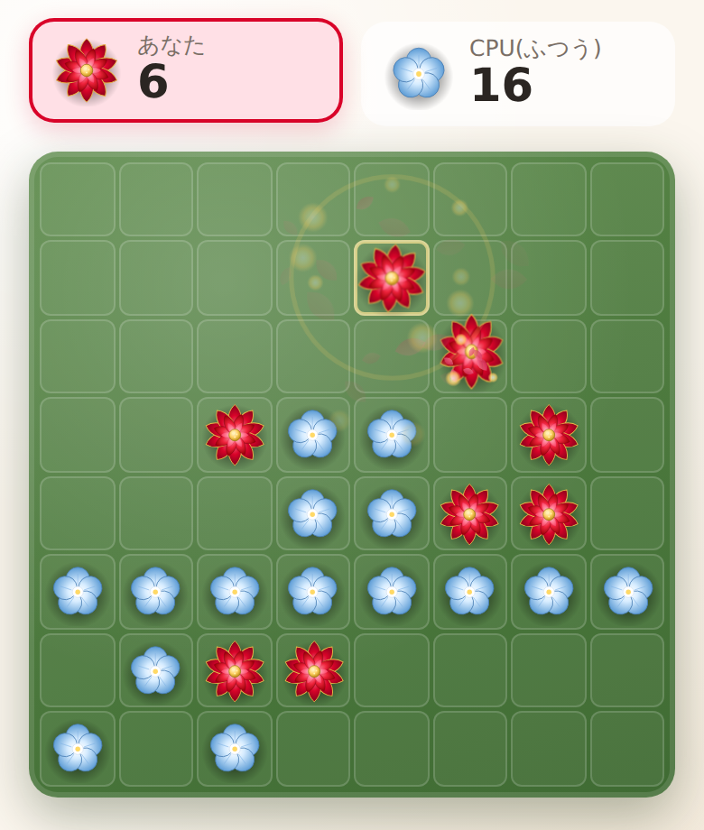
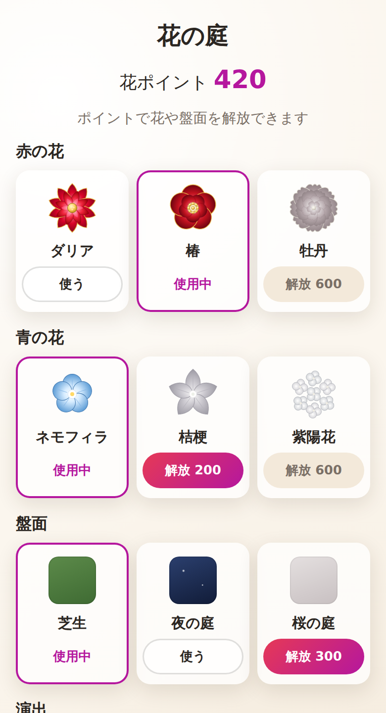
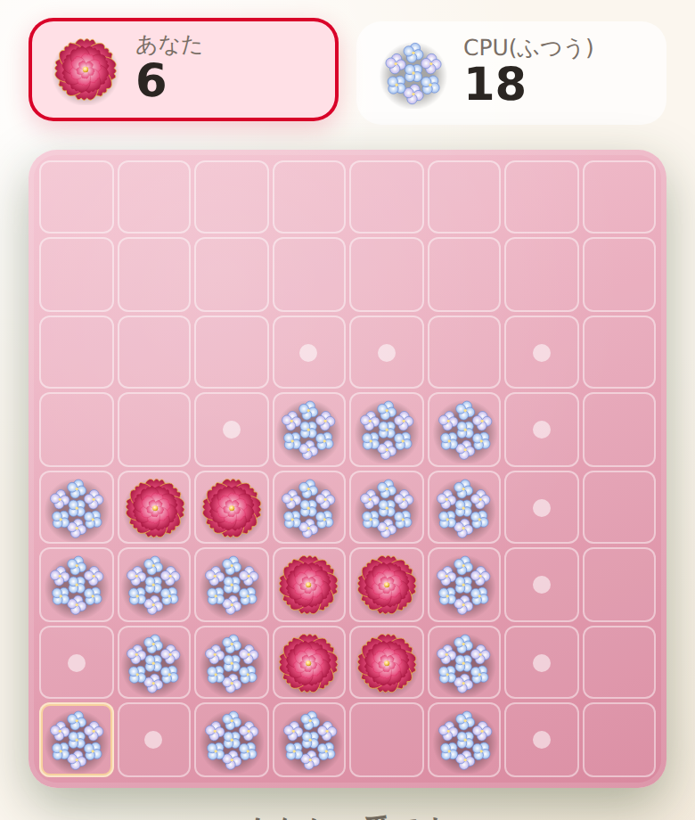
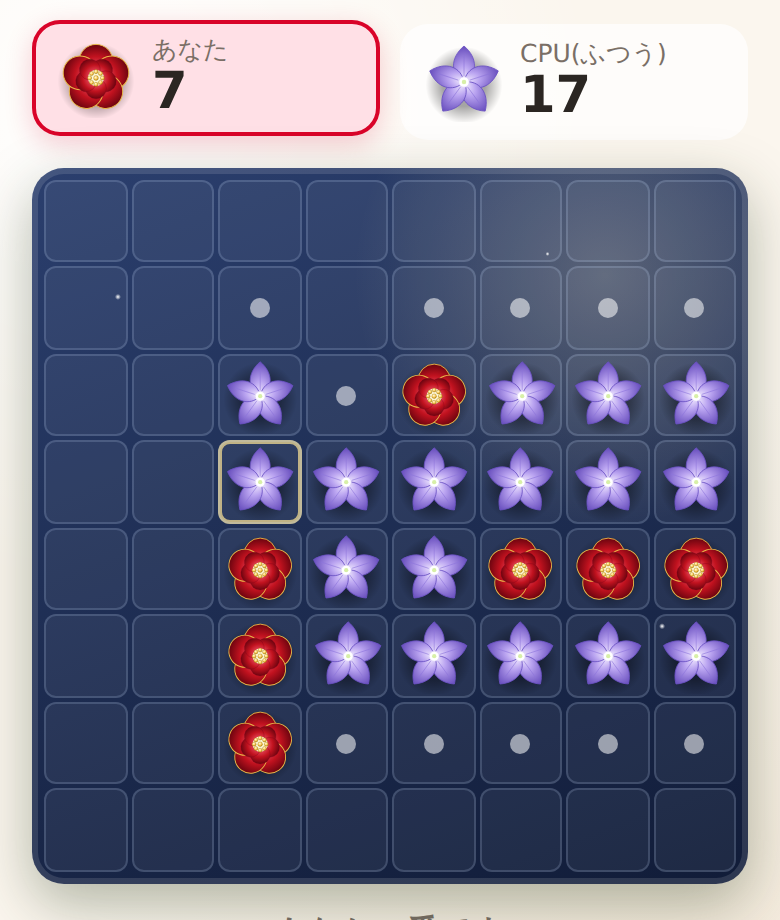

# Flower Reversi — 花を咲かせるリバーシ

石の代わりに花を置くリバーシ。赤はゴージャスなダリア、青は可憐なネモフィラ。置けば花が開き、挟めば花びらを散らしながら次々と色が変わっていく。

**▶ [ブラウザで遊ぶ](https://tinkling-way-games.github.io/flower-reversi/)** — インストール不要・ログイン不要。スマホの縦画面で遊ぶことを前提に作っている。

## 花が咲く手ざわり

- **赤はゴージャス、青は可憐**: 赤は幾重にも重なる花びらと金の花芯。回転しながら花開き、金色のきらめきが舞う。青は小さな5枚花びら。ふわっと膨らんで咲き、水色の花びらがそっと舞う
- **裏返りが波のように広がる**: 挟んだ花は置いた場所から近い順に、時間差で立体的に回転して色が変わる。裏返った花からは新しい色の花びらがこぼれる
- **音も花ごとに違う**: 赤は厚みのある和音のチャイム、青は軽く澄んだ単音。音声ファイルは使わず、ブラウザの中で合成している
- **目にやさしく**: OS の「視差効果を減らす」設定が有効なら動きを最小限にする。待機中は画面を描き直さないので、スマホが熱くなりにくい

## 遊び方

ルールは普通のリバーシと同じ。8×8 の盤で、**赤が先手**。

- 相手の花を縦・横・斜めに挟める場所にだけ置ける。置ける場所は盤上の小さな点で示す
- 置ける場所がないときは自動でパス。両者とも置けなくなったら終局し、花の多いほうが勝ち

| モード | 内容 |
| --- | --- |
| **一人用** | CPU と対戦する。自分の色(赤 / 青)と難易度を選ぶ |
| **二人用** | 1 台の端末を交代で使う。手番が変わるたびに「交代画面」が出て、次の人がタップしてから盤面が見える(設定でオフにできる) |

### CPU の難易度

| 難易度 | CPU の考え方 |
| --- | --- |
| かんたん | 置ける場所からランダムに選ぶ |
| ふつう | 角を好み、角の隣を避ける。1 手先だけを見る |
| むずかしい | 4 手先まで読む。盤面の位置の価値と置ける場所の多さで形勢を判断し、空きマスが残り 10 以下になったら最後まで読み切る |

## 花の庭 — ポイントで花を増やす

一人用で勝つと、スコアが **花ポイント** として貯まる。花ポイントを使うと「花の庭」で新しい花や盤面を解放できる。変わるのは見た目だけで、勝敗には影響しない。

- スコア = (終局時の自分の花の数 + 勝敗ボーナス) × 難易度倍率。むずかしいほど多く貯まる
- 解放したものは、いつでも花の庭で切り替えられる

| 種類 | 最初から | 解放できるもの(花ポイント) |
| --- | --- | --- |
| 赤の花 | ダリア | 椿(200)・牡丹(600) |
| 青の花 | ネモフィラ | 桔梗(200)・紫陽花(600) |
| 盤面 | 芝生 | 夜の庭(300)・桜の庭(300) |
| 演出 | 標準 | 花吹雪(500): 舞う花びらときらめきが倍以上になる |

| 桜の庭 × 牡丹 × 紫陽花 | 夜の庭 × 椿 × 桔梗 |
| --- | --- |
|  |  |

### 記録

タイトルの「記録」から、難易度ごとの勝ち負け・最高スコアと、二人用の勝敗を見られる。「記録をリセット」で対戦記録と花ポイントを消せる(解放した花は残る)。

記録はブラウザの中(`localStorage`)にだけ保存され、どこにも送信しない。端末・ブラウザごとに別々になる。

## Claude Code で作ったゲーム

このゲームは、スマホから [Claude Code on the web](https://code.claude.com/docs/en/claude-code-on-the-web) を操作して、企画・実装・公開までを一気通貫で作った。コードとドキュメントは Claude Code が書き、人間は要望を出す・スマホで遊んで感想や不具合を伝える・PR をマージする役に回っている。

- **画面を見られない前提で検証する**: 人間の手元にはスマホしかないので、盤面のルールや CPU の思考はユニットテストで確かめ、見た目はコンテナ内のブラウザでスマホ幅のスクリーンショットを撮って共有している
- **依存パッケージゼロ**: 開発コンテナから npm レジストリに届かないため、テスト・開発サーバー・ビルドを Node.js の標準機能だけで組んだ。ゲーム本体もビルド不要のプレーンな JavaScript
- **実機の不具合を遠隔で追う**: 予期しないエラーは画面下部に赤い帯で表示され、URL に `?debug` を付けると手番や合法手などの内部状態が見える。スクリーンショット 1 枚で原因を追えるようにしてある

仕様は [`docs/game-spec.md`](docs/game-spec.md) に、依存ゼロ構成にした理由は [`docs/environment.md`](docs/environment.md) にまとめた。

## 技術メモ

- プレーンな ES Modules(JavaScript)+ SVG。フレームワーク・ゲームエンジン・外部アセットなし
- 効果音は Web Audio でその場で合成している
- iPhone での発熱を抑えるため、無限ループするアニメーションや盤上の `filter` を使わず、舞う粒子の同時数にも上限を設けている
- サーバーサイドの処理はなく、GitHub Pages で静的に配信している

手元で動かす方法・コードの構成・公開の手順は [`docs/development.md`](docs/development.md) を参照。
